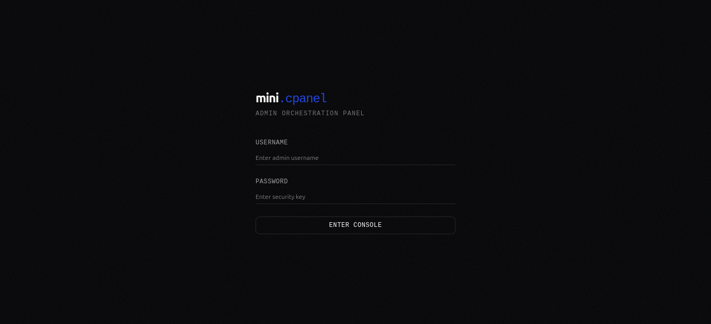
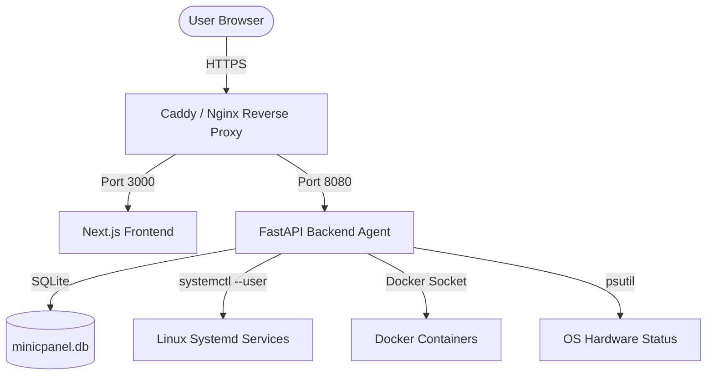

# mini.cpanel

A minimalist, lightweight, and self-hosted server orchestration dashboard designed to deploy and monitor personal web applications and background services.

[](https://nextjs.org)
[](https://fastapi.tiangolo.com)
[](https://www.typescriptlang.org)
[](https://www.python.org)
[](https://www.sqlite.org)
[](LICENSE)

<br />

👉 **[Live Demo](https://demo.cpanel.dilua.site/)**


<br />

<p align="center">
  
</p>

---

## Technical Stack

* **Frontend**: Next.js (React 19), Tailwind CSS, TypeScript, Monospace & Outfit typography.
* **Backend**: FastAPI (Python 3), SQLAlchemy ORM, SQLite database, and system-level telemetry.
* **Service Orchestration**:
  * **Linux**: Native Systemd service management (user-space or root).
  * **Windows**: NSSM (Non-Sucking Service Manager) for Windows Services.
  * **Universal**: Native Docker CLI integration via Docker Engine sockets.

---

## System Architecture



---

## Core Features

1. **System Telemetry & Telemetries**: Real-time tracking of hardware health (CPU, memory, disk usage, and uptime) with sparkline visualizers, and ingress traffic monitoring (requests per second, HTTP status codes, and bandwidth usage).
2. **Project Deployer & Auto-Setup Engine**: Automated deployment of projects directly from Git repositories using Docker, Systemd (Linux), or NSSM (Windows) with dynamic port allocation. Features an **Auto-Setup Engine** that automatically detects project stacks and configures environments for **Node.js, Bun, Python (virtualenv), PHP (Composer), Go, and Rust**.
3. **Deployment History & Build Logs**: Tracks git commit metadata (commit message, SHA, author, and timestamp) for every deployment run and records comprehensive build/compilation logs.
4. **Web-Based File Explorer**: Interactive file manager allowing users to browse, create, delete, and edit files (such as configuration `.env` files) directly in their web browser.
5. **Database Administrator**: A lightweight administration interface to inspect tables, review schemas, perform pagination on rows, and execute raw SQL queries securely for SQLite, PostgreSQL, and MySQL.
6. **Task Scheduler (Cron Jobs)**: An integrated task scheduler with an interactive cron expression generator and log monitors to capture output and execution history.
7. **Backup & Recovery System**: Folder and database compression tools with scheduled automated backups, supporting local storage and remote storage configurations.
8. **SSL/HTTPS Automation**: Automated Let's Encrypt SSL certificate issuance and renewal (via ACME/Certbot) for configured domains and subdomains pointing to the server.
9. **System Alerting**: Integration with Telegram and Discord webhooks to dispatch notifications when hardware thresholds are exceeded or if service status changes.
10. **Global Docker Manager**: Full visual dashboard to track all running/stopped Docker containers on the host, stream logs, monitor real-time resource utilization, view active networks/volumes, and prune dangling images.
11. **Ingress Proxy Router**: Map custom domain routes directly to internal ports or external host addresses, write proxy server configurations dynamically, trigger service hot-reloads, and request automatic Let's Encrypt SSL certificates.

---

## API Documentation

Complete developer reference for all FastAPI REST endpoints and WebSockets is available in the [docs/README.md](docs/README.md) file.


---

## Installation & Getting Started (Local Development)

### Prerequisites
* Python 3.10 or newer
* Node.js v18 or newer (with npm)
* Git
* (Optional) Docker Engine

### 1. Set Up the Backend Agent (`api`)
1. Navigate to the backend directory and create a Python Virtual Environment:
   ```bash
   cd api
   python -m venv .venv
   ```
2. Activate the virtual environment:
   * **Linux/macOS**: `source .venv/bin/activate`
   * **Windows**: `.venv\Scripts\activate`
3. Install the dependencies:
   ```bash
   pip install .
   ```
4. Start the development server using Uvicorn:
   ```bash
   uvicorn app.main:app --host 127.0.0.1 --port 8080 --reload
   ```

### 2. Set Up the Frontend Dashboard (`web`)
1. Navigate to the frontend directory:
   ```bash
   cd web
   ```
2. Install the Node.js packages:
   ```bash
   npm install
   ```
3. Run the Next.js development server:
   ```bash
   npm run dev
   ```
   Open [http://localhost:3000](http://localhost:3000) to access the dashboard.

---

## Deployment Options

### Option A: Static Frontend hosting (Vercel / Netlify)
Since the frontend of `mini.cpanel` is a Next.js application, it can be deployed on static hosting platforms like Vercel or Netlify.
1. Link your GitHub repository to Vercel or Netlify.
2. Add the following environment variable in the dashboard project configuration:
   * `NEXT_PUBLIC_API_URL`: The public domain URL of your backend server (e.g., `https://api.yourdomain.com`).
3. Deploy the application.
*Note: The backend API agent must run on a persistent virtual private server (VPS) because it requires direct, low-level OS access (Docker, systemd) to run orchestration commands.*

### Option B: Unified VPS Deployment with a Private Domain (Recommended)
This approach runs both the frontend and backend on the same VPS, exposed securely under a private domain or subdomain.

#### 1. Configure the Backend as a Persistent Daemon (Linux Systemd)
To ensure the backend runs continuously in the background, create a systemd service file at `/etc/systemd/system/minicpanel-api.service`:

```ini
[Unit]
Description=Mini cPanel FastAPI Backend Service
After=network.target

[Service]
User=yourusername
WorkingDirectory=/home/yourusername/mini-cpanel/api
ExecStart=/home/yourusername/mini-cpanel/api/.venv/bin/uvicorn app.main:app --host 127.0.0.1 --port 8080
Restart=always

# Environment Variables
Environment="CPANEL_SECRET_KEY=your-production-secret-key"
Environment="CPANEL_BACKEND_CORS_ORIGINS=https://cpanel.yourdomain.com"
Environment="CPANEL_DATA_DIR=/home/yourusername/.minicpanel"
Environment="CPANEL_APPS_DIR=/home/yourusername/apps"

[Install]
WantedBy=multi-user.target
```

Enable and start the service:
```bash
sudo systemctl daemon-reload
sudo systemctl enable minicpanel-api.service
sudo systemctl start minicpanel-api.service
```

#### 2. Configure the Frontend as a Background Daemon
1. Build the production application in the `/web` directory:
   ```bash
   npm run build
   ```
2. Start the daemon process. You can use PM2 to manage the background process:
   ```bash
   pm2 start npm --name "minicpanel-web" -- start
   ```

#### 3. Set Up a Secure Reverse Proxy (Caddy / Nginx)
To handle SSL certificates automatically and expose your dashboard securely over port 80/443, use **Caddy Server** (recommended for automatic Let's Encrypt integration).

Create a `Caddyfile`:
```caddy
cpanel.yourdomain.com {
    # Route main requests to the Next.js frontend
    reverse_proxy localhost:3000
}

cpanel.yourdomain.com/api/* {
    # Route API requests to the FastAPI backend agent
    reverse_proxy localhost:8080
}
```

Run Caddy to enable HTTPS automatically.


### Option C: Portable Binary

If you prefer to run Mini cPanel as a single zero-dependency executable on your VPS:

#### 1. Download & Run the Binary
Log into your Linux VPS and execute the following:

```bash
# Download the latest Linux x86_64 binary
wget https://github.com/jimbon25/mini-cpanel/releases/latest/download/mini-cpanel

# Grant execute permissions
chmod +x mini-cpanel

# Start the panel (optionally pass a custom port)
./mini-cpanel 8080
```

#### 2. Access in Browser
Open `http://YOUR_VPS_IP:8080` in your web browser. The **Web Installation Wizard** will automatically launch to help you register your admin username and password.


> [!NOTE]
> All database settings, user accounts, and project configs are stored in a folder named `cpanel-data/` created **automatically next to the executable**. Keep this folder to retain your configuration and projects.

> [!WARNING]
> For remote VPS deployments, if the page buffers or times out, make sure you open the selected port (e.g. `8080`) in your VPS provider's firewall dashboard.

---

## GitHub Auto-Deploy Webhook Setup

You can configure automatic redeployments whenever code is pushed to your Git repository:

1. **Get Webhook Details**: Under the project configuration card in the dashboard, expand the **Git Webhook** section to reveal your project's unique **Payload URL** (e.g., `http://your-domain/api/v1/projects/webhook/<project-id>`) and **Secret Key**.
2. **Configure GitHub**:
   - Open your project repository on GitHub.
   - Navigate to **Settings** -> **Webhooks** -> **Add webhook**.
   - Paste the **Payload URL** from your dashboard.
   - Change the **Content type** to `application/json`.
   - Paste the **Secret Key** into the **Secret** field.
   - Choose **Just the push event** and click **Add webhook**.
3. **Verify**: Run a `git push` to your repository. Mini cPanel will verify the cryptographic signature, trigger a redeployment in the background, fetch the latest commit details, and log the build process.

---

## Testing

* **Backend Tests (Pytest)**:
  ```bash
  cd api
  .venv/bin/pytest
  ```
* **Frontend Tests (Jest)**:
  ```bash
  cd web
  npm test
  ```

---

## Support

If you find this project useful, feel free to buy me a cup of iced milk coffee:

[](https://saweria.co/dimasla)

---

## Support & Bug Reports

If you encounter any bugs, security vulnerabilities, or have general feedback, please feel free to open a GitHub Issue or contact me directly at [luisdimas838@gmail.com](mailto:luisdimas838@gmail.com).


